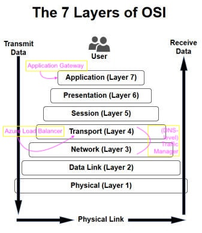

# Configure and manage virtual networks

## Create connectivity between virtual networks

* create and configure [VNet peering](https://docs.microsoft.com/en-us/azure/virtual-network/virtual-network-peering-overview)
  * Benefits
    * Connect 2 VNets in same region
    * Routed through Azure Backbone(= no custom encryption like S2S VPN)
  * Requirements
    * Same Region & Across Regions
    * Non-overlapping IP Addresses
      * Static IP addresses are the equivalent to DHCP reservations
      * Address prefix comes from VNet/subnet definitions
      * Azure reserves the **first three** and the **last** IP from the pool
      * First address of a /24 is .4
    * No Transitivity
  * Capabilities
    * Open or Close NSGs
    * Internal DNS only within VNet, no Azure DNS across
  * Peering uses the MS Backbone; if you want(custom) additional encryption, use S2S VPN
* create and configure VNet to VNet connections
* verify virtual network connectivity
* create virtual network gateway

**Hybrid Connectivity Options**
| Site-to-Site (S2S) VPN Gateway | Express Route | Point-to-Site (P2S) |
|----|----|----|
| connecting data center to Azure over VPN | dedicated circuit from data center to Azure | connecting clients directly to VNET |
| connection over IPsec/IKE VPN tunnel |  | Secure connection from an individual computer. Great for remote worker situations. |
| requires a VPN device in enterprise datacenter that has a public IP assigned to it |  | No need for a VPN device or public IP. Connect wherever user has internet connection. |
| can be used for cross-premises and hybrid configurations |  | OS Support: Windows 7, 8, 8.1 (32 adn 64bit), Windows 10, Windows Server 2008 R2, 2012, 2012 R2 64bit |
| must not be located behind a NAT |  | Throughput up to 100 Mbps (unpredictable due to internet) |
| | | Doesn't scale easily, so only useful for a few workstations. |

**ExpressRoute Considerations**

_Understand the models:_

* Differences between Unlimited Data and Metered Data
* Understand what model you are using today to accelerate adoption
* Understand the differences in available port speeds, locations, and approach
* Understand the limits that drive additional circuits

_Understand the providers:_

* Each offer a different experience based on ecosystem and capabilities
* Some provide complete solutions and management

_Understand the costs:_

* Connection costs can be broken out by the service connection costs (Azure) and the authorized carrier costs (telco partner)
* Unlike other Azure services, look beyond the Azure pricing calculator

| **Peering - Data to Collect** | |
|----|----|
| **Azure Private Peering** | • Peering subnet for path 1 (/30)<br/>• Peering subnet for path 2 (/30)<br/>• VLAN ID for peering<br/>• ASN for peering<br/>• ExpressRoute ASN = 12076<br/>• MD5 Hash (optional)|
| **Azure Public Peering** | • Peering sunet for path 1 (/30) - must be public IP<br/>• Peering subnet for path 2 (/30) - must be public IP<br/>• VLAN ID for peering<br/>• ASN for peering<br/>• ExpressRoute ASN = 12076<br/>• MD5 Hash (optional) |
| **Mircosoft Peering** | • Peering subnet for path 1 (/30) - must be public IP<br/>• Peering subnet for path 2 (/30) - must be public IP<br/>• VLAN ID for peering<br/>• ASN for peering<br/>• Advertised prefixes - must be public IP prefixes<br/>• Customer ASN (optional if different from peering ASN)<br/>• RIR/IRR for IP and ASN validation<br/>• ExpressRoute ASN = 12076<br/>• MD5 Hash (optional) |

**VPN Gateway SKUs**
| SKU | S2S/<br/>VNET-to-VNET<br/>Tunnels | P2S<br/>Connections | Aggregrate<br/>Throughput<br/>Benchmark | Recommended<br/>Workloads | Features |
|----|----|----|----|----|----|
| **VpnGw1** | Max 30 | Max 128 | 650 Mbps | Production,<br/>critical workloads | **Route-based VPN:**<br/>up to 30 tunnels<br/>P2S<br/>BGP<br/>active-active<br/>custom IPsec/IKE policy<br/>ExpressRoute/VPN co-existence |
| **VpnGw2** | Max 30 | Max 128 | 1 Gbps | Production,<br/>critical workloads |**Route-based VPN:**<br/>up to 30 tunnels<br/>P2S<br/>BGP<br/>active-active<br/>custom IPsec/IKE policy<br/>ExpressRoute/VPN co-existence |
| **VpnGw3** | Max 30 | Max 128 | 1.25 Gbps | Production,<br/>critical workloads |**Route-based VPN:**<br/>up to 30 tunnels<br/>P2S<br/>BGP<br/>active-active<br/>custom IPsec/IKE policy<br/>ExpressRoute/VPN co-existence |
| **Basic** | Max 10 | Max 128 | 100 Mbps | Dev-tst or POC | **Route-based VPN:**<br/>10 tunnels with P2S<br/>no RADIUS authentication for P2S<br/>no IKEv2 for P2S<br/>**Policy-based VPN:**<br/> (IKEv1): 1 tunnel<br/>no P2S |

| **Unlimited versus Metered** | |
|----|----|
| **Unlimited** | • Speeds from 50 Mbps to 10 Gbps<br/>• Unlimited Inbound data transfer<br/>• Unlimited Outbound data transfer<br/>• Higher monthly fee |
| **Metered** | • Speeds from 50 Mbps to 10 Gbps<br/>• Unlimited Inbound data transfer<br/>• Outbound data transfer charged at a predetermined rate per GB<br/>• Lower monthly fee |

## Implement and manage virtual networking

* configure private and public IP addresses, network routes, network interface, subnets, and virtual network

1. Create a resource group
2. Create a single VNet
3. Create subnets for each independent grouping
4. Enable service endpoints for the VNet
5. Enable service endpints for the subnets

| Public IP | Private IP |
|----|----|
| Separate Azure Object | Allocated from subnet range |
| Public Azure Service | Internal resolution by Azure DNS |
| VMs, ILBs, VPN, App GWs | Subnet, part of VNet range |
| Dynamic (default) or Static | VM, ILBs, App GWs |
| DNS hostname resolution| Dynamic (default) or Static |

## Configure name resolution

* configure Azure DNS
  * You cannot use Azure DNS to buy a domain name, so purchase domain using domain name registrar.
  * Configure a forward DNS Zone in Azure.
    * This resolves DNS names to IP addresses. You will create all DNS records needed for the new application.
    * Zone name must be unique within resource group
    * Can add Azure tags for billing or grouping
    * Creating the zone makes SOA and NS records in Azure
      * The SOA record is important for the DNS server that hosts the DNS zone. The SOA record is automatically created when you purchase the domain name.
  * Create an NS Record in your registrar that points to azure-dns servers.
    * An NS record represents the name server that hosts the DNS zone for a DNS domain. If you do not change the default configuration in your domain name registrar, these NS records point to your registrar's own DNS servers. You need to create or modify existing NS records in your registrar to point to `ns1-01.azure-dns.com`, `ns2-01.azure.dns.net`, `ns3-01.azure-dns.org`, and `ns4-01.azure-dns.info`.
    * Azure DNS supports all common records
    * Use Record Sets for more than one record of the same name and type + wildcard!
    * SOA and CNAME are exceptions to above ^
  * Delegate Domain to Azure DNS
    * Must know zone server names
    * `Get-AzureRmDnsZone -Name contoso.net -ResourceGroupName MyResourceGroup`
  * A reverse DNS zone in Azure is used to convert IP addresses to domain names.
  * A forward DNS zone in Azure is used to resolve domain names to IP addresses.
* configure custom DNS settings
* configure private and public DNS zones

## Create and configure a Network Security Group (NSG)

* create security rules
  * Apply at subnet or NIC
  * Only 1 NSG per Azure resource
  * Only TCP or UDP
  * Special Rules:
    * Microsoft Owned IP Address: `168.63.129.16`
    * Outbound Port `1688` reserved for KMS
* associate NSG to a subnet or network interface

```Powershell
# To associated an NSG to a VNet
Set-AzVirtualNetworkSubnetConfig

# To save the changes that you made to an object that represents an NSG, for example, when you add an additional security rule
Set-AzNetworkSecurityGroup

# To save teh changes that you made to an object that represents a security rule. For example, when you want to change teh access for a security rule from Allow to Deny.
Set-AzNetworkSecurityRuleConfig

# To modify a NIC configured for a VM.
$Nic = Get-AzNetworkInterface -ResourceGroupName "ResourceGroup1" -Name "NetworkInterface1"
$Nic.IpConfigurations[0].PrivateIpAddress = "10.0.1.20"
$Nic.IpConfigurations[0].PrivateIpAllocationMethod = "Static"
$Nic.Tag = @{Name = "Name"; Value = "Value"}
Set-AzNetworkInterface -NetworkInterface $Nic
```

* identify required ports
* evaluate effective security rules

## Implement Azure load balancer

* configure internal load balancer
  * Private IP address
  * Load balances ALL traffic (TCP, UDP – all ports)
  * Sits behind an external load balancer
  * Cannot combineexternal and internal traffic at the sametime
* configure load balancing rules
* configure public load balancer
  * Internet-facing IP-address
    * This minimizes the number of Azure public IP addresses required.
  * Load balances ALL traffic (TCP, UDP – all ports) across VMs if they are identically configured
  * Required when deploying Virtual Machine Availability Sets
  * Can communicate with Azure InternalLoad Balancer and/or Application Gateway
  * Cannot combineexternal and internal traffic at the sametime
  * Use Network Address Translation (NAT) to reach the VMs
  * Obfuscates any management ports on the VMs
* troubleshoot load balancing
  * Network Watcher
    * Recently added networking feature, providing:
      * Topology
      * Variable Packet Capture
      * IP Flow Verify
      * Next Hop
        * Traffic from a virtual machine (VM) is sent to a destination based on the effective routes associated with a network interface (NIC). Next hop gets the next hop type and IP address of a packet from a specific VM and NIC. Knowing the next hop helps you determine if traffic is being directed to the intended destination, or whether the traffic is being sent nowhere. An improper configuration of routes, where traffic is directed to an on-premises location, or a virtual appliance, can lead to connectivity issues. Next hop also returns the route table associated with the next hop. If the route is defined as a user-defined route, that route is returned. Otherwise, next hop returns System Route.
      * Diagnostics Logging
      * Security Group View
      * NSG Flow Logging
      * VPN Gateway Troubleshooting
      * Network Subscription Limits
      * Role Based Access Control
      * Connectivity
    * Must enable it for the desired region
      * Go to Network Watcher overview
      * Expand regions in subscription
      * Enable for the region you want
      * Connection Monitor tab to monitor vm

| **Load Balancing Options:** | Key Features |
|----|----|
| Azure Load Balancer | • Layer 4 Transport<br/> • Basic and Standard (Preview) SKUs<br/> • Service Monitoring<br/> • Automated Reconfiguration<br/> • Hash based distribution<br/> • Interal and Public Options |
| Application Gateway | • Layer 7 Application Load Balancing<br/> • Cookie based session affinity <br/> • SSL Offload<br/> • End to End SSL<br/> • Web Application Firewall<br/> • URL Based Content Routing<br/> • Requires its own subnet |



| BASIC | STANDARD |
|----|----|
| Up to 100 backend instances | Up to 1000 instances |
| Non-zonal frontent | Zone-redundant frontend <br/> Zonal frontend |
| Availability Set (single) | Availability Sets not required |
| Basic NAT and Probe health status | Integrated frontend and backend health metrics |
| no HA ports | Supports HA ports |
| NSG optional | NSG required |
| Free | Charged based on number of rules, data processed inboud and outbound associated with resource |

## Monitor and troubleshoot virtual networking

* monitor on-premises connectivity, use Network resource monitoring, use Network Watcher, troubleshoot external networking, troubleshoot virtual network connectivity

## Integrate on premises network with Azure virtual network

* create and configure Azure VPN Gateway, create and configure site to site VPN, configure Express Route, verify on premises connectivity, troubleshoot on premises connectivity with Azure

| resource | description |
|----|----|
| ExpresssRoute | allows you to connect your on-prem infrastructure with Azure |
| VPN Gateway | a specific type of virtual network gateway that is used to send encrypted traffic between an Azure virtual network and an on-premises location over the public Internet (one VPN per VNet) |

| VPN<br/>Gateway<br/>Generation | SKU | S2S/VNet-to-VNet<br/>Tunnels | P2S<br/>SSTP<br/>Connections | P2S<br/>IKEv2/OpenVPN<br/>Connections | Aggregate<br/>Throughput<br/>Benchmark | BGP | Zone-redundant |
|----|----|----|----|----|----|----|----|
| Generation1 | Basic | Max. 10 | Max. 128 | Not Supported | 100 Mbps | Not Supported | No |
| Generation1 | VpnGw1 | Max. 30* | Max. 128 | Max. 250 | 650 Mbps | Supported | No |
| Generation1 | VpnGw2 | Max. 30* | Max. 128 | Max. 500 | 1 Gbps | Supported | No |
| Generation1 | VpnGw3 | Max. 30* | Max. 128 | Max. 1000 | 1.25 Gbps | Supported | No |
| Generation1 | VpnGw1AZ | Max. 30* | Max. 128 | Max. 250 | 650 Mbps | Supported | Yes |
| Generation1 | VpnGw2AZ | Max. 30* | Max. 128 | Max. 500 | 1 Gbps | Supported | Yes |
| Generation1 | VpnGw3AZ | Max. 30* | Max. 128 | Max. 1000 | 1.25 Gbps | Supported | Yes |
| Generation2 | VpnGw2 | Max. 30* | Max. 128 | Max. 500 | 1.25 Gbps | Supported | No |
| Generation2 | VpnGw3 | Max. 30* | Max. 128 | Max. 1000 | 2.5 Gbps | Supported | No |
| Generation2 | VpnGw4 | Max. 30* | Max. 128 | Max. 5000 | 5 Gbps | Supported | No |
| Generation2 | VpnGw5 | Max. 30* | Max. 128 | Max. 10000 | 10 Gbps | Supported | No |
| Generation2 | VpnGw2AZ | Max. 30* | Max. 128 | Max. 500 | 1.25 Gbps | Supported | Yes |
| Generation2 | VpnGw3AZ | Max. 30* | Max. 128 | Max. 1000 | 2.5 Gbps | Supported | Yes |
| Generation2 | VpnGw4AZ | Max. 30* | Max. 128 | Max. 5000 | 5 Gbps | Supported | Yes |
| Generation2 | VpnGw5AZ | Max. 30* | Max. 128 | Max. 10000 |
