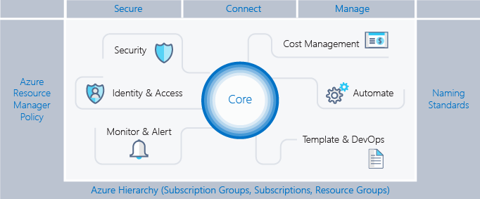

# Manage Azure subscriptions and resources

## Manage Azure subscriptions

* assign administrator permissions
  * [how to transfer billing ownership](https://docs.microsoft.com/en-us/azure/billing/billing-subscription-transfer)
  * [how to associate or add a subscription to your AAD tenant](https://docs.microsoft.com/en-us/azure/active-directory/fundamentals/active-directory-how-subscriptions-associated-directory)
* configure cost center quotas and tagging
* configure policies at Azure subscription level
  * [How many Azure subscriptions is enough?](https://blogs.technet.microsoft.com/tangent_thoughts/2017/10/17/how-many-azure-subscriptions-is-enough-aka-msazuresubscriptions/)

## Analyze resource utilization and consumption

* configure diagnostic settings on resources
* create baseline for resources
* create and test alerts
  * [Azure Monitor](https://docs.microsoft.com/en-us/azure/azure-monitor/overview)
    * Centralized hub for different Azure Resources Monitoring aspects:
      * Alerts
      * Metrics
      * Log Analytics
        * Start with the source table (e.g. Event)
        * Follow on with a series of operators
        * Separate out additional operation by using pipe
        * Join other tables and workspaces using "union"

          ```
          # These are the same
          Event | search "error"
          search in (Event) "error"
          ```

          | Uri | IP | Ports |
          |----|----|----|
          | portal.loganalytics.io | Dynamic | 80,443 |
          | api.loganalytics.io | Dynamic | 80,443 |
          | docs.loganalytics.io | Dynamic | 80,443 |

      * Service Health
      * Application Insights
      * Network Watcher
* analyze alerts across subscription
* analyze metrics across subscription
* [create action groups](https://docs.microsoft.com/en-us/azure/azure-monitor/platform/action-groups) and action rules
  * Define an Action Type
    * Email / SMS / Push / Voice
    * Azure Function
    * LogicApp
    * Webhook
    * ITSM
    * Automation Runbook
* monitor for unused resources
* monitor spend
  * [Azure Cost Management](https://docs.microsoft.com/en-us/azure/cost-management/overview-cost-mgt)
  * [Cloudyn](https://docs.microsoft.com/en-us/azure/cost-management/overview)
* report on spend
* utilize log queries in Azure Monitor
* view alerts in Azure Monitor

## Manage resource groups

* use Azure policies for resource groups
* configure resource locks
* configure resource policies
* identify auditing requirements
* implement and set tagging on resource groups
* move resources across resource groups
  * Checklist:
    * Common Azure AD Tenant
    * Common resource providers
    * Quotas exceeded?
    * Minimum permissions
    * Limit of 800 moves, possible timeouts
  * Resources you CANNOT move across resource groups:
    * AD Domain Services
    * AD Hybrid Health Service
    * Application Gateway
    * Azure Database for MySQL
    * Azure Database for PostgreSQL
    * Azure Database Migration
    * Azure Databricks
    * Azure Migrate
    * Batch AI
    * Certificates - App Service Certificates can be moved, but uploaded certificates have limitations.
    * Container Instances
    * Container Service
    * Data Box
    * Dev Spaces
    * Dynamics LCS
    * Express Route
    * Kubernetes Service
    * Lab Services – not across subscriptions
    * Load Balancers
    * Managed Applications
    * Managed Disks
    * Microsoft Genomics
    * NetApp
    * Public IP
    * Recovery Services vault
    * SAP HANA on Azure
    * Security
    * Site Recovery
    * StorSimple Device Manager
    * Virtual Networks (classic)
* remove resource groups

## Managed role based access control ([RBAC](https://docs.microsoft.com/en-us/azure/role-based-access-control/overview))

* create a custom role
* configure access to Azure resources by assigning roles
* configure management access to Azure, troubleshoot RBAC, implement RBAC policies, assign RBAC Roles

| role | description |
|----|----|
| Owner | can manager everything, including access |
| Contributor | can manage everything, except access |
| Reader | can view everything, but can't make changes |
| User Access Administrator | lets you manage user access to Azure resources |
| Virtual Machine Contributor | lets you manage virtual machines, but not access to them, and not the virutal network or storage account they're connected to |

**[Access Inheritance](https://docs.microsoft.com/en-us/azure/cloud-adoption-framework/reference/azure-scaffold)**

Subscription ---> Resource Groups ---> Resources



----

# Implement and manage storage

----

## Create and configure storage accounts

* [configure network access to the storage account](https://docs.microsoft.com/en-us/azure/virtual-network/tutorial-restrict-network-access-to-resources)
* create and configure storage account
  * Storage Service Encryption (SSE) is enabled automatically on all Azure storage accounts and encrypts all teh storage account data at rest.
  * Storage Service Encryption (SSE), in its native form, uses Microsoft-managed access keys.
  * Secure transfer forces all REST API calls to use HTTPS instead of HTTP.
  * A service endpoint between a VNet and a storage account allows you to limit traffic to a storage account from resources residing on an Azure VNet.
  * _Custom domain mapping_ - Create a CNAME record with your DNS provider that points from:
    * 1.) Your domain - simpler but results in a brief downtime while Azure verifies the domain registration
    * 2.) The `asverify` subdomain
      * point `asverify.yourdomain.com` to `asverify.storageacct.blob.core.windows.net`
      * after this step completes, you can create a CNAME record that points to `storageacct.blob.core.windows.net`
      * no downtime
      * must select "Use Indirect CNAMEValidation" checkbox
* generate shared access signature
* install and use Azure Storage Explorer
* manage access keys
  * Storage account keys may be stored in Azure Key Vault.
* monitor activity log by using Monitor Logs
* implement Azure storage replication
  * LRS, ZRS, GRS, GRS-RA
* implement Azure AD authentication

| Replication Strategy | LRS | ZRS | GRS | RA-GRS |
|----|----|----|----|----|
| Data is replicated across multiple datacenters | No | Yes | Yes | Yes |
| Data can be read from a secondary location _and_ the primary location? | No | No | No | Yes |
| Number of copies of data maintained on separate nodes: | 3 | 3 | 6 | 6 |

----

| BLOCK BLOB | PAGE BLOB |
|----|----|
| Ideal for storing text or binary files | Efficient for read/write operations |
| A single block blog can contain up to 50k blocks of up to 100Mb each, for a total size of 4.75TB | Used by Azure VMs |
| Append blobs are optimized for append operations (e.g.) logging | Up to 8TB in size |

| HOT | COLD | ARCHIVE |
|----|----|----|
| • Higher storage costs<br/>• Lower access costs | • Lower storage costs<br/>• Higher access costs<br/>• Intended for data that will remain cool for 30 days or more |  • Lower storage costs<br/>• Highest retrieval costs<br/>• When a blob is in archive storage, it is offline and cannot be read |

| BLOBS | FILES | DISKS |
|----|----|----|
| • Access application data from anywhere<br/>• Large amount of objects to store - images, videos, etc. | • Access files across multiple machines<br/>• Jumpbox scenarios for shared development scenarios | • Do not need to access the data outside the VM<br/>• Lift-and-shift machines from on-premises<br/>• Disk expansion for application installations |

| Storage account type | Supported services | Supported performance tiers | Supported access tiers | Replication options | Deployment model | Encryption |
|----|----|----|----|----|----|----|
| General-purpose V2 | Blob, File, Queue, Table, Disk, and Data Lake Gen2 | Standard, Premium | Hot, Cool, Archive | LRS, GRS, RA-GRS, ZRS, GZRS (preview), RA-GZRS (preview)| Resource Manager | Encrypted |
| General-purpose V1 | Blob, File, Queue, Table, and Disk | Standard, Premium  | N/A | LRS, GRS, RA-GRS | Resource Manager, Classic | Encrypted |
| BlockBlobStorage | Blob (block blobs and append blobs only) | Premium | N/A | LRS, ZRS | Resource Manager | Encrypted |
| FileStorage | File only | Premium | N/A | LRS, ZRS | Resource Manager | Encrypted |
| BlobStorage | Blob (block blobs and append blobs only) | Standard | Hot, Cool, Archive | LRS, GRS, RA-GRS | Resource Manager | Encrypted |

----

|Scenario | Locally Redundant Storage (LRS) | Zone-Redundant Storage (ZRS) | Geo-redundant Storage (GRS)/RA-GRS | GZRS/RA-GZRS (preview)|
|----|----|----|----|----|
|Node unavailability within a data center | Yes | Yes | Yes | Yes|
|An entire data center (zonal or non-zonal) becomes unavailable | No | Yes | Yes | Yes|
|A region-wide outage | No | No | Yes | Yes|
|Read access to your data (in a remote, geo-replicated region) in the event of region-wide unavailability | No | No | Yes (with RA-GRS) | Yes (with RA-GZRS)|
|Designed to provide __ durability of objects over a given year1 | at least 99.999999999% (11 9's) | at least 99.9999999999% (12 9's) | at least 99.99999999999999% (16 9's) | at least 99.99999999999999% (16 9's)|
|Supported storage account types2 | GPv2, GPv1, BlockBlobStorage, BlobStorage, FileStorage | GPv2, BlockBlobStorage, FileStorage | GPv2, GPv1, BlobStorage | GPv2|
|Availability SLA for read requests1 | At least 99.9% (99% for cool access tier) | At least 99.9% (99% for cool access tier) | At least 99.9% (99% for cool access tier) for GRS <br/>At least 99.99% (99.9% for cool access tier) for RA-GRS | At least 99.9% (99% for cool access tier) for GZRS <br/> At least 99.99% (99.9% for cool access tier) for RA-GZRS|
|Availability SLA for write requests1 | At least 99.9% (99% for cool access tier) | At least 99.9% (99% for cool access tier) | At least 99.9% (99% for cool access tier) | At least 99.9% (99% for cool access tier)|

----

## Import and export data to Azure

**Azure Import/Export Use Cases** 

| Data Migration to Cloud | Content Distribution | Backup | Data Recovery |
|----|----|----|----|
| Move large amts. of data to Azuzre quickly | Sending data to customer sites | Backing up your on-prem data to store it in Azure | Recover data from storage and send back to your on-prem data center |

* create export from Azure job
* create import into Azure job

**Import/Export Components**

| import/export service | command-line tool | disk drives |
|----|----|----|
| > accessed via the Azure Portal<br/>> used to track data:<br/>• import (upload) jobs<br/>• export (download) jobs | > prepare disk drives that are shipped<br/>> copy data to your drive<br/>> encrypts data with BitLocker<br/>> generates drive journal files<br/>> determines number of drives<br/>> use V1 for blob and V2 for files | > disk drives: <br/>• HDDs<br/>• SSDs<br/>• import jobs: you ship drives containing your data<br/>• export jobs: you ship empty drives |

  * disk drives
    * HDDs
    * SSDs

| Standard Storage | Premium Storage |
|----|----|
| Backed by traditional HDD | Backed by SSD drives |
| Most cost effective | Higher performance |
| Max throughput - 60MB/S per disk | Max throughput - 250MB/S per disk |
| Max IOPS 500 IOPS per disk | Max IOPS - 7500 IOPS per disk |

* use Azure Data Box
* configure and use Azure blob storage
* configure [Azure content delivery network (CDN)](https://docs.microsoft.com/en-us/azure/cdn/cdn-overview) endpoints
  * Create a CDN profile
  * Create a new CDN endpoint
  * Wait
    * Microsoft CDN profiles: 10 minutes
    * Akamai CDN profiles: 1 minute
    * Verizon profiles: 90 minutes
  * Know the difference between Standard and Premium tiers

**Azure CDN Offerings**

| P1 Premium Verizon<br/>(optimized for rules/redirection/blocking content/etc) | S2 Standard Verizon<br/>(optimized for rules/redirection/blocking content/etc) | S1 Standard Akamai<br/>(optimized for media) |
|----|----|----|
| All standard features | Endpoint HTTPS | Endpoint HTTPS |
| Token authenintication | Custom domain HTTPS | Content Purge |
| Performance analytics | Content purge/load | Compression |
| Realtime analytics | Compression | Geo-filtering |
| Mobile device rules | Geo-filtering | Large file optimization |
| Custom rules engine | Core analytics | Media optimization |
| Cache/header settings | Dynamic delivery | Core analytics |
| URL redirect/rewrite | | Dynamic site acceleration<br/>- Adaptive image compression<br/>- Object prefetch |

----

* Azure Storage Accounts and Managed Disks
  * Regular data types go to Azure Storage Accounts (blobs)
  * VHD disk upload to Azure Marketplace custom deployments

* Storage Account Explorer
  * GUI or REST API

* Portal, PowerShell, Azure CLI

* Data is more than Azure Storage
  * Databases (SQL, MySQL, CosmosDB, ...)

----

## Configure Azure files

* create Azure file share
* create Azure File Sync service

| Supported on | NOT Supported on |
|----|----|
| Windows Server 2012r2/2016 | Other file systems period |
| NTFS Volumes/Compression | Sysprep
| DFS with 1.2 Agent | NTFS EFS |
| BitLocker, AIP, AAD, RMS | No other HSM |

* create Azure sync group
  * Defines Sync Topology for set of files
* troubleshoot Azure File Sync
  * [What is Azure Files?](https://docs.microsoft.com/en-us/azure/storage/files/storage-files-introduction)
  * [Deploy Azure File Sync](https://docs.microsoft.com/en-us/azure/storage/files/storage-sync-files-deployment-guide?tabs=azure-portal)

## Implement Azure backup

* configure and review backup reports
* perform backup operation
* create Recovery Services Vault
* create and configure backup policy
* perform a restore operation

* Azure Backup Components
  * Azure Backup (MARS) Agent
  * System Center DPM
  * Azure Backup Server
  * Azure IaaS VM Backup

* Snapshot Recovery
  * Blob snapshots taken of VM page blob
  * Snapshots can be copied into the same or different regions
  * VMs get created from snapshots
  * Application-consistent if VM was shutdown, otherwise crash-consistent

* Geo-replication
  * Uses Azure Storage GRS (Geo-redundant storage)
  * Data is replicated to a paired region far away from the primary copy
  * Data recovery in the event of an outage or entire region unavailable
