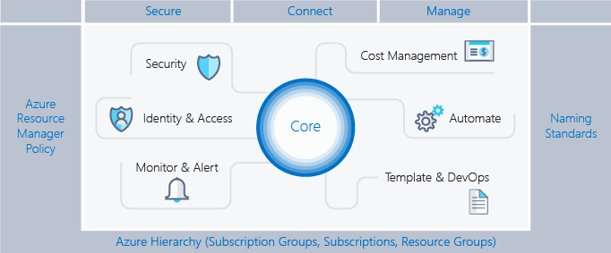

# AZ-103 Microsoft Certified: Azure Administrator Associate – Skills Measured

## Manage Azure subscriptions and resources

----

### Manage Azure subscriptions

* assign administrator permissions
  * [how to transfer billing ownership](https://docs.microsoft.com/en-us/azure/billing/billing-subscription-transfer)
  * [how to associate or add a subscription to your AAD tenant](https://docs.microsoft.com/en-us/azure/active-directory/fundamentals/active-directory-how-subscriptions-associated-directory)
* configure cost center quotas and tagging
* configure policies at Azure subscription level
  * [How many Azure subscriptions is enough?](https://blogs.technet.microsoft.com/tangent_thoughts/2017/10/17/how-many-azure-subscriptions-is-enough-aka-msazuresubscriptions/)

### Analyze resource utilization and consumption

* configure diagnostic settings on resources
* create baseline for resources
* create and test alerts
  * [Azure Monitor](https://docs.microsoft.com/en-us/azure/azure-monitor/overview)
    * Centralized hub for different Azure Resources Monitoring aspects:
      * Alerts
      * Metrics
      * Log Analytics
        * Start with the source table (e.g. Event)
        * Follow on with a series of operators
        * Separate out additional operation by using pipe
        * Join other tables and workspaces using "union"

          ```
          # These are the same
          Event | search "error"
          search in (Event) "error"
          ```

          | Uri | IP | Ports |
          |----|----|----|
          | portal.loganalytics.io | Dynamic | 80,443 |
          | api.loganalytics.io | Dynamic | 80,443 |
          | docs.loganalytics.io | Dynamic | 80,443 |

      * Service Health
      * Application Insights
      * Network Watcher
* analyze alerts across subscription
* analyze metrics across subscription
* [create action groups](https://docs.microsoft.com/en-us/azure/azure-monitor/platform/action-groups) and action rules
  * Define an Action Type
    * Email / SMS / Push / Voice
    * Azure Function
    * LogicApp
    * Webhook
    * ITSM
    * Automation Runbook
* monitor for unused resources
* monitor spend
  * [Azure Cost Management](https://docs.microsoft.com/en-us/azure/cost-management/overview-cost-mgt)
  * [Cloudyn](https://docs.microsoft.com/en-us/azure/cost-management/overview)
* report on spend
* utilize log queries in Azure Monitor
* view alerts in Azure Monitor

### Manage resource groups

* use Azure policies for resource groups
* configure resource locks
* configure resource policies
* identify auditing requirements
* implement and set tagging on resource groups
* move resources across resource groups
  * Checklist:
    * Common Azure AD Tenant
    * Common resource providers
    * Quotas exceeded?
    * Minimum permissions
    * Limit of 800 moves, possible timeouts
  * Resources you CANNOT move across resource groups:
    * AD Domain Services
    * AD Hybrid Health Service
    * Application Gateway
    * Azure Database for MySQL
    * Azure Database for PostgreSQL
    * Azure Database Migration
    * Azure Databricks
    * Azure Migrate
    * Batch AI
    * Certificates - App Service Certificates can be moved, but uploaded certificates have limitations.
    * Container Instances
    * Container Service
    * Data Box
    * Dev Spaces
    * Dynamics LCS
    * Express Route
    * Kubernetes Service
    * Lab Services – not across subscriptions
    * Load Balancers
    * Managed Applications
    * Managed Disks
    * Microsoft Genomics
    * NetApp
    * Public IP
    * Recovery Services vault
    * SAP HANA on Azure
    * Security
    * Site Recovery
    * StorSimple Device Manager
    * Virtual Networks (classic)
* remove resource groups

### Managed role based access control ([RBAC](https://docs.microsoft.com/en-us/azure/role-based-access-control/overview))

* create a custom role
* configure access to Azure resources by assigning roles
* configure management access to Azure, troubleshoot RBAC, implement RBAC policies, assign RBAC Roles

| role | description |
|----|----|
| Owner | can manager everything, including access |
| Contributor | can manage everything, except access |
| Reader | can view everything, but can't make changes |
| User Access Administrator | lets you manage user access to Azure resources |
| Virtual Machine Contributor | lets you manage virtual machines, but not access to them, and not the virutal network or storage account they're connected to |

**[Access Inheritance](https://docs.microsoft.com/en-us/azure/cloud-adoption-framework/reference/azure-scaffold)**

Subscription ---> Resource Groups ---> Resources



## Implement and manage storage

----

### Create and configure storage accounts

* [configure network access to the storage account](https://docs.microsoft.com/en-us/azure/virtual-network/tutorial-restrict-network-access-to-resources)
* create and configure storage account
  * Storage Service Encryption (SSE) is enabled automatically on all Azure storage accounts and encrypts all teh storage account data at rest.
  * Storage Service Encryption (SSE), in its native form, uses Microsoft-managed access keys.
  * Secure transfer forces all REST API calls to use HTTPS instead of HTTP.
  * A service endpoint between a VNet and a storage account allows you to limit traffic to a storage account from resources residing on an Azure VNet.
  * _Custom domain mapping_ - Create a CNAME record with your DNS provider that points from:
    * 1.) Your domain - simpler but results in a brief downtime while Azure verifies the domain registration
    * 2.) The `asverify` subdomain
      * point `asverify.yourdomain.com` to `asverify.storageacct.blob.core.windows.net`
      * after this step completes, you can create a CNAME record that points to `storageacct.blob.core.windows.net`
      * no downtime
      * must select "Use Indirect CNAMEValidation" checkbox
* generate shared access signature
* install and use Azure Storage Explorer
* manage access keys
  * Storage account keys may be stored in Azure Key Vault.
* monitor activity log by using Monitor Logs
* implement Azure storage replication
  * LRS, ZRS, GRS, GRS-RA
* implement Azure AD authentication

----

| BLOCK BLOB | PAGE BLOB |
|----|----|
| Ideal for storing text or binary files | Efficient for read/write operations |
| A single block blog can contain up to 50k blocks of up to 100Mb each, for a total size of 4.75TB | Used by Azure VMs |
| Append blobs are optimized for append operations (e.g.) logging | Up to 8TB in size |

| HOT | COLD | ARCHIVE |
|----|----|----|
| • Higher storage costs<br/>• Lower access costs | • Lower storage costs<br/>• Higher access costs<br/>• Intended for data that will remain cool for 30 days or more |  • Lower storage costs<br/>• Highest retrieval costs<br/>• When a blob is in archive storage, it is offline and cannot be read |

| BLOBS | FILES | DISKS |
|----|----|----|
| • Access application data from anywhere<br/>• Large amount of objects to store - images, videos, etc. | • Access files across multiple machines<br/>• Jumpbox scenarios for shared development scenarios | • Do not need to access the data outside the VM<br/>• Lift-and-shift machines from on-premises<br/>• Disk expansion for application installations |

| Storage account type | Supported services | Supported performance tiers | Supported access tiers | Replication options | Deployment model | Encryption |
|----|----|----|----|----|----|----|
| General-purpose V2 | Blob, File, Queue, Table, Disk, and Data Lake Gen2 | Standard, Premium | Hot, Cool, Archive | LRS, GRS, RA-GRS, ZRS, GZRS (preview), RA-GZRS (preview)| Resource Manager | Encrypted |
| General-purpose V1 | Blob, File, Queue, Table, and Disk | Standard, Premium  | N/A | LRS, GRS, RA-GRS | Resource Manager, Classic | Encrypted |
| BlockBlobStorage | Blob (block blobs and append blobs only) | Premium | N/A | LRS, ZRS | Resource Manager | Encrypted |
| FileStorage | File only | Premium | N/A | LRS, ZRS | Resource Manager | Encrypted |
| BlobStorage | Blob (block blobs and append blobs only) | Standard | Hot, Cool, Archive | LRS, GRS, RA-GRS | Resource Manager | Encrypted |

----

|Scenario | Locally Redundant Storage (LRS) | Zone-Redundant Storage (ZRS) | Geo-redundant Storage (GRS)/RA-GRS | GZRS/RA-GZRS (preview)|
|----|----|----|----|----|
|Node unavailability within a data center | Yes | Yes | Yes | Yes|
|An entire data center (zonal or non-zonal) becomes unavailable | No | Yes | Yes | Yes|
|A region-wide outage | No | No | Yes | Yes|
|Read access to your data (in a remote, geo-replicated region) in the event of region-wide unavailability | No | No | Yes (with RA-GRS) | Yes (with RA-GZRS)|
|Designed to provide __ durability of objects over a given year1 | at least 99.999999999% (11 9's) | at least 99.9999999999% (12 9's) | at least 99.99999999999999% (16 9's) | at least 99.99999999999999% (16 9's)|
|Supported storage account types2 | GPv2, GPv1, BlockBlobStorage, BlobStorage, FileStorage | GPv2, BlockBlobStorage, FileStorage | GPv2, GPv1, BlobStorage | GPv2|
|Availability SLA for read requests1 | At least 99.9% (99% for cool access tier) | At least 99.9% (99% for cool access tier) | At least 99.9% (99% for cool access tier) for GRS <br/>At least 99.99% (99.9% for cool access tier) for RA-GRS | At least 99.9% (99% for cool access tier) for GZRS <br/> At least 99.99% (99.9% for cool access tier) for RA-GZRS|
|Availability SLA for write requests1 | At least 99.9% (99% for cool access tier) | At least 99.9% (99% for cool access tier) | At least 99.9% (99% for cool access tier) | At least 99.9% (99% for cool access tier)|

----

### Import and export data to Azure

**Azure Import/Export Use Cases** 

| Data Migration to Cloud | Content Distribution | Backup | Data Recovery |
|----|----|----|----|
| Move large amts. of data to Azuzre quickly | Sending data to customer sites | Backing up your on-prem data to store it in Azure | Recover data from storage and send back to your on-prem data center |

* create export from Azure job
* create import into Azure job

**Import/Export Components**

| import/export service | command-line tool | disk drives |
|----|----|----|
| > accessed via the Azure Portal<br/>> used to track data:<br/>• import (upload) jobs<br/>• export (download) jobs | > prepare disk drives that are shipped<br/>> copy data to your drive<br/>> encrypts data with BitLocker<br/>> generates drive journal files<br/>> determines number of drives<br/>> use V1 for blob and V2 for files | > disk drives: <br/>• HDDs<br/>• SSDs<br/>• import jobs: you ship drives containing your data<br/>• export jobs: you ship empty drives |

  * disk drives
    * HDDs
    * SSDs
    * 
    * 

* use Azure Data Box
* configure and use Azure blob storage
* configure [Azure content delivery network (CDN)](https://docs.microsoft.com/en-us/azure/cdn/cdn-overview) endpoints
  * Create a CDN profile
  * Create a new CDN endpoint
  * Wait
    * Microsoft CDN profiles: 10 minutes
    * Akamai CDN profiles: 1 minute
    * Verizon profiles: 90 minutes
  * Know the difference between Standard and Premium tiers

**Azure CDN Offerings**

| P1 Premium Verizon<br/>(optimized for rules/redirection/blocking content/etc) | S2 Standard Verizon<br/>(optimized for rules/redirection/blocking content/etc) | S1 Standard Akamai<br/>(optimized for media) |
|----|----|----|
| All standard features | Endpoint HTTPS | Endpoint HTTPS |
| Token authenintication | Custom domain HTTPS | Content Purge |
| Performance analytics | Content purge/load | Compression |
| Realtime analytics | Compression | Geo-filtering |
| Mobile device rules | Geo-filtering | Large file optimization |
| Custom rules engine | Core analytics | Media optimization |
| Cache/header settings | Dynamic delivery | Core analytics |
| URL redirect/rewrite | | Dynamic site acceleration<br/>- Adaptive image compression<br/>- Object prefetch |

----

* Azure Storage Accounts and Managed Disks
  * Regular data types go to Azure Storage Accounts (blobs)
  * VHD disk upload to Azure Marketplace custom deployments

* Storage Account Explorer
  * GUI or REST API

* Portal, PowerShell, Azure CLI

* Data is more than Azure Storage
  * Databases (SQL, MySQL, CosmosDB, ...)

----

### Configure Azure files

* create Azure file share
* create Azure File Sync service

| Supported on | NOT Supported on |
|----|----|
| Windows Server 2012r2/2016 | Other file systems period |
| NTFS Volumes/Compression | Sysprep
| DFS with 1.2 Agent | NTFS EFS |
| BitLocker, AIP, AAD, RMS | No other HSM |

* create Azure sync group
  * Defines Sync Topology for set of files
* troubleshoot Azure File Sync
  * [What is Azure Files?](https://docs.microsoft.com/en-us/azure/storage/files/storage-files-introduction)
  * [Deploy Azure File Sync](https://docs.microsoft.com/en-us/azure/storage/files/storage-sync-files-deployment-guide?tabs=azure-portal)

### Implement Azure backup

* configure and review backup reports
* perform backup operation
* create Recovery Services Vault
* create and configure backup policy
* perform a restore operation

## Deploy and manage virtual machines (VMs)

----

### Create and configure a VM for Windows and Linux

* configure high availability
* configure monitoring, networking, storage, and virtual machine size
* [deploy and configure scale sets](https://blogs.technet.microsoft.com/tangent_thoughts/2016/08/25/got-vm-scale-sets-aka-msazurevmss/)

### Automate deployment of VMs

* modify Azure Resource Manager (ARM) template
  * JSON files with a predefined syntax and schema
    * parameters
    * variables
    * resources
    * outputs
  * Azure and Azure Stack compatible
  * Deployment from:
    * [Azure Portal / Add Resource / Template Deployment](https://docs.microsoft.com/en-us/azure/azure-resource-manager/templates/quickstart-create-templates-use-the-portal?toc=%2Fazure%2Fvirtual-machines%2Fwindows%2Ftoc.json)
    * [PowerShell](https://docs.microsoft.com/en-us/azure/virtual-machines/windows/tutorial-manage-vm?toc=%2Fazure%2Fvirtual-machines%2Fwindows%2Ftoc.json)
    * [Azure CLI](https://docs.microsoft.com/en-us/azure/virtual-machines/windows/quick-create-cli)
  * GitHub -> [Azure QuickStart Templates](https://github.com/Azure/AzureStack-QuickStart-Templates)
  * Visual Studio Code
  * Visual Studio 2015 adn up (all editions)
* configure location of new VMs
* configure VHD template
* deploy from template
* save a deployment as an ARM template
  * If you want to export a template with all of the resources in a resource group, you can export the ARM template from the resource group level.

```Powershell
Export-AzResourceGroup
      -ResourceGroupName <String>
      [-Path <String>]
      [-IncludeParameterDefaultValue]
      [-IncludeComments]
      [-Force]
      [-ApiVersion <String>]
      [-Pre]
      [-DefaultProfile <IAzureContextContainer>]
      [-InformationAction <ActionPreference>]
      [-InformationVariable <String>]
      [-WhatIf]
      [-Confirm]
      [<CommonParameters>]
```

  * The parameters file exported contains the parameters that were used during that deployment.
  * The template contains needed scripts for deploying the template. When you download an ARM template from a deployment or a resource group, the downloaded package contains 7 files:
    * the ARM template,
    * the parameters file,
    * an Azure CLI script,
    * a Powershell script,
    * a Ruby script,
    * and a .NET class for deploying the template.
* deploy Windows and Linux VMs

### Manage Azure VM

* add data discs
* add network interfaces
* [automate configuration management by using PowerShell Desired State Configuration (DSC) and VM Agent by using custom script extensions](https://docs.microsoft.com/en-us/azure/virtual-machines/extensions/dsc-template)
* manage VM sizes
* move VMs from one resource group to another
* redeploy VMs
* soft delete for Azure VMs

### Manage VM backups

* configure VM backup
* define backup policies
* implement backup policies
* perform VM restore
* [Azure Site Recovery](https://docs.microsoft.com/en-us/azure/site-recovery/site-recovery-overview)

| Supported | Details |
|----|----|
| Replication scenarios | • Replicate Azure VMs from one Azure region to another. <br/>• Replicate on-premises VMware VMs, Hyper-V VMs, physical servers (Windows and Linux), Azure Stack VMs to Azure.<br/>• Replicate AWS Windows instances to Azure.<br/>• Replicate on-premises VMware VMs, Hyper-V VMs managed by System Center VMM, and physical servers to a secondary site.|
| Regions | Review supported regions for Site Recovery. |
| Replicated machines | Review the replication requirements for Azure VM replication, on-premises VMware VMs and physical servers, and on-premises Hyper-V VMs. |
| Workloads | You can replicate any workload running on a machine that's supported for replication. In addition, the Site Recovery team have performed app-specific testing for a number of apps. |

## Configure and manage virtual networks

----

### Create connectivity between virtual networks

* create and configure [VNet peering](https://docs.microsoft.com/en-us/azure/virtual-network/virtual-network-peering-overview)
  * Benefits
    * Connect 2 VNets in same region
    * Routed through Azure Backbone(= no custom encryption like S2S VPN)
  * Requirements
    * Same Region & Across Regions
    * Non-overlapping IP Addresses
    * No Transitivity
  * Capabilities
    * Open or Close NSGs
    * Internal DNS only within VNet, no Azure DNS across
  * Peering uses the MS Backbone; if you want(custom) additional encryption, use S2S VPN
* create and configure VNet to VNet connections
* verify virtual network connectivity
* create virtual network gateway

### Implement and manage virtual networking

* configure private and public IP addresses, network routes, network interface, subnets, and virtual network

1. Create a resource group
2. Create a single VNet
3. Create subnets for each independent grouping
4. Enable service endpoints for the VNet
5. Enable service endpints for the subnets

| Public IP | Private IP |
|----|----|
| Separate Azure Object | Allocated from subnet range |
| Public Azure Service | Internal resolution by Azure DNS |
| VMs, ILBs, VPN, App GWs | Subnet, part of VNet range |
| Dynamic (default) or Static | VM, ILBs, App GWs |
| DNS hostname resolution| Dynamic (default) or Static |

### Configure name resolution

* configure Azure DNS
  * You cannot use Azure DNS to buy a domain name, so purchase domain using domain name registrar.
  * Configure a forward DNS Zone in Azure.
    * This resolves DNS names to IP addresses. You will create all DNS records needed for the new application.
    * Zone name must be unique within resource group
    * Can add Azure tags for billing or grouping
    * Creating the zone makes SOA and NS records in Azure
      * The SOA record is important for the DNS server that hosts the DNS zone. The SOA record is automatically created when you purchase the domain name.
  * Create an NS Record in your registrar that points to azure-dns servers.
    * An NS record represents the name server that hosts the DNS zone for a DNS domain. If you do not change the default configuration in your domain name registrar, these NS records point to your registrar's own DNS servers. You need to create or modify existing NS records in your registrar to point to `ns1-01.azure-dns.com`, `ns2-01.azure.dns.net`, `ns3-01.azure-dns.org`, and `ns4-01.azure-dns.info`.
    * Azure DNS supports all common records
    * Use Record Sets for more than one record of the same name and type + wildcard!
    * SOA and CNAME are exceptions to above ^
  * Delegate Domain to Azure DNS
    * Must know zone server names
    * `Get-AzureRmDnsZone -Name contoso.net -ResourceGroupName MyResourceGroup`
  * A reverse DNS zone in Azure is used to convert IP addresses to domain names.
  * A forward DNS zone in Azure is used to resolve domain names to IP addresses.
* configure custom DNS settings
* configure private and public DNS zones

### Create and configure a Network Security Group (NSG)

* create security rules
  * Apply at subnet or NIC
  * Only 1 NSG per Azure resource
  * Only TCP or UDP
  * Special Rules:
    * Microsoft Owned IP Address: `168.63.129.16`
    * Outbound Port `1688` reserved for KMS
* associate NSG to a subnet or network interface

```Powershell
# To associated an NSG to a VNet
Set-AzVirtualNetworkSubnetConfig

# To save the changes that you made to an object that represents an NSG, for example, when you add an additional security rule
Set-AzNetworkSecurityGroup

# To save teh changes that you made to an object that represents a security rule. For example, when you want to change teh access for a security rule from Allow to Deny.
Set-AzNetworkSecurityRuleConfig

# To modify a NIC configured for a VM.
$Nic = Get-AzNetworkInterface -ResourceGroupName "ResourceGroup1" -Name "NetworkInterface1"
$Nic.IpConfigurations[0].PrivateIpAddress = "10.0.1.20"
$Nic.IpConfigurations[0].PrivateIpAllocationMethod = "Static"
$Nic.Tag = @{Name = "Name"; Value = "Value"}
Set-AzNetworkInterface -NetworkInterface $Nic
```

* identify required ports
* evaluate effective security rules

### Implement Azure load balancer

* configure internal load balancer
  * Private IP address
  * Load balances ALL traffic (TCP, UDP – all ports)
  * Sits behind an external load balancer
  * Cannot combineexternal and internal traffic at the sametime
* configure load balancing rules
* configure public load balancer
  * Internet-facing IP-address
    * This minimizes the number of Azure public IP addresses required.
  * Load balances ALL traffic (TCP, UDP – all ports) across VMs if they are identically configured
  * Required when deploying Virtual Machine Availability Sets
  * Can communicate with Azure InternalLoad Balancer and/or Application Gateway
  * Cannot combineexternal and internal traffic at the sametime
  * Use Network Address Translation (NAT) to reach the VMs
  * Obfuscates any management ports on the VMs
* troubleshoot load balancing
  * Network Watcher
    * Recently added networking feature, providing:
      * Topology
      * Variable Packet Capture
      * IP Flow Verify
      * Next Hop
      * Diagnostics Logging
      * Security Group View
      * NSG Flow Logging
      * VPN Gateway Troubleshooting
      * Network Subscription Limits
      * Role Based Access Control
      * Connectivity

| BASIC | STANDARD |
|----|----|
| Up to 100 backend instances | Up to 1000 instances |
| Non-zonal frontent | Zone-redundant frontend <br/> Zonal frontend |
| Availability Set (single) | Availability Sets not required |
| Basic NAT and Probe health status | Integrated frontend and backend health metrics |
| no HA ports | Supports HA ports |
| NSG optional | NSG required |
| Free | Charged based on number of rules, data processed inboud and outbound associated with resource |

### Monitor and troubleshoot virtual networking

* monitor on-premises connectivity, use Network resource monitoring, use Network Watcher, troubleshoot external networking, troubleshoot virtual network connectivity

### Integrate on premises network with Azure virtual network

* create and configure Azure VPN Gateway, create and configure site to site VPN, configure Express Route, verify on premises connectivity, troubleshoot on premises connectivity with Azure

| resource | description |
|----|----|
| ExpresssRoute | allows you to connect your on-prem infrastructure with Azure |
| VPN Gateway | a specific type of virtual network gateway that is used to send encrypted traffic between an Azure virtual network and an on-premises location over the public Internet (one VPN per VNet) |

| VPN<br/>Gateway<br/>Generation | SKU | S2S/VNet-to-VNet<br/>Tunnels | P2S<br/>SSTP<br/>Connections | P2S<br/>IKEv2/OpenVPN<br/>Connections | Aggregate<br/>Throughput<br/>Benchmark | BGP | Zone-redundant |
|----|----|----|----|----|----|----|----|
| Generation1 | Basic | Max. 10 | Max. 128 | Not Supported | 100 Mbps | Not Supported | No |
| Generation1 | VpnGw1 | Max. 30* | Max. 128 | Max. 250 | 650 Mbps | Supported | No |
| Generation1 | VpnGw2 | Max. 30* | Max. 128 | Max. 500 | 1 Gbps | Supported | No |
| Generation1 | VpnGw3 | Max. 30* | Max. 128 | Max. 1000 | 1.25 Gbps | Supported | No |
| Generation1 | VpnGw1AZ | Max. 30* | Max. 128 | Max. 250 | 650 Mbps | Supported | Yes |
| Generation1 | VpnGw2AZ | Max. 30* | Max. 128 | Max. 500 | 1 Gbps | Supported | Yes |
| Generation1 | VpnGw3AZ | Max. 30* | Max. 128 | Max. 1000 | 1.25 Gbps | Supported | Yes |
| Generation2 | VpnGw2 | Max. 30* | Max. 128 | Max. 500 | 1.25 Gbps | Supported | No |
| Generation2 | VpnGw3 | Max. 30* | Max. 128 | Max. 1000 | 2.5 Gbps | Supported | No |
| Generation2 | VpnGw4 | Max. 30* | Max. 128 | Max. 5000 | 5 Gbps | Supported | No |
| Generation2 | VpnGw5 | Max. 30* | Max. 128 | Max. 10000 | 10 Gbps | Supported | No |
| Generation2 | VpnGw2AZ | Max. 30* | Max. 128 | Max. 500 | 1.25 Gbps | Supported | Yes |
| Generation2 | VpnGw3AZ | Max. 30* | Max. 128 | Max. 1000 | 2.5 Gbps | Supported | Yes |
| Generation2 | VpnGw4AZ | Max. 30* | Max. 128 | Max. 5000 | 5 Gbps | Supported | Yes |
| Generation2 | VpnGw5AZ | Max. 30* | Max. 128 | Max. 10000 |

## Manage identities

----

### Manage Azure Active Directory (AD)

* add custom domains
* Azure AD Join
  * Requires:
    * Azure AD + Subscription
    * Windows 10 (Pro/Ent)
  * Admin Tasks
  * User Tasks
    * [Register Windows 10 Device – BYOD](https://docs.microsoft.com/en-us/azure/active-directory/user-help/user-help-register-device-on-network)
    * Join Corp Device
      * Settings, Account, Access Work or School
  * Verify
* configure self-service password reset
* manage multiple directories

* Enterprise State Roaming - With Windows 10, Azure Active Directory (Azure AD) users gain the ability to securely synchronize their user settings and application settings data to the cloud. Enterprise State Roaming provides users with a unified experience across their Windows devices and reduces the time needed for configuring a new device. Enterprise State Roaming operates similar to the standard consumer settings sync that was first introduced in Windows 8.
  * Requires:
    * Azure AD Premium or Enterprise Mobility + Security (EMS) license
    * Windows 10
    * Azure AD Domain Join
      * This requires that you deploy Azure AD Connect to allow you to synchronize objects in your on-prem AD DS domain with an Azure AD tenant.
  * 3 regions: NA, EMEA, APAC
  * Not replicated across
  * Country/Regioin set on attribute and cannot be changed after
  * Retained until deleted or becomes "stale"

### Manage Azure AD objects (users, groups, and devices)

* create users and groups
* manage user and group properties
* manage device settings
* perform bulk user updates
  * PowerShell
    * Import a CSV
    * Export from HR or SQL
  * Process
    * Connect-AzureAD (MSonline still works, mainly used for Office 365 integration)
    * Define Variables
* manage guest accounts

| Rules | Desc | Code Example |
|----|----|----|
| Direct Reports | You can create a group containing all direct reports of a manager. When the manager's direct reports change in the future, the group's membership is adjusted automatically. | `Direct Reports for "{objectID_of_manager}"` |
| All Users | You can create a group containing all users within a tenant using a membership rule. When users are added or removed from the tenant in the future, the group's membership is adjusted automatically. | `user.objectid -ne null` |
| Extensions | Extension attributes and custom extension properties are supported as string properties in dynamic membership rules. Extension attributes are synced from on-premises Window Server AD and take the format of "ExtensionAttributeX", where X equals 1 - 15. | `(user.extensionAttribute15 -eq "Marketing")` |
| Custom Extensions | Custom extension properties are synced from on-premises Windows Server AD or from a connected SaaS application  <br/>`[GUID]` is the unique identifier in Azure AD for the application that created the property in Azure AD<br/>`[Attribute]` is the name of the property as it was created| `user.extension_[GUID]_[Attribute]` |


| Azure Active Directory Conditional Access |  if a user wants to access a resource, then they must complete an action |
|----|----|
| Users and groups | In your policy, you can either select All users or select specific users and groups. When you Select users and groups, you can set the following options:<br/>• All guest users<br/>• Directory roles<br/>• Users and groups |
| Cloud apps and actions | Mandatory in a Conditional Access policy. In your policy, you can either select:<br/>• All cloud apps or<br/>• specify apps with Select apps.|
| Sign-in risk | An indicator of the likelihood (high, medium, or low) that a sign-in wasn't made by the legitimate owner of a user account. To use this condition, you need to have Azure Active Directory Identity Protection enabled. |
| Device platforms | Operating system on a client. Supports the following device platforms:<br/>• Android<br/>• iOS<br/>• Windows Phone<br/>• Windows<br/>• macOS |
| Device state | The device state condition excludes hybrid Azure AD joined devices and devices marked as compliant from a Conditional Access policy. This condition is useful when a policy should apply only to an unmanaged device to provide additional session security. For example, only enforce the Microsoft Cloud App Security session control when a device is unmanaged. |
| Locations | Based on where a connection was attempted. Common use cases for this condition are policies with the following protections:<br/>• Require multi-factor authentication for users accessing a service when they're off the corporate network.<br/>• Block access for users accessing a service from specific countries or regions.|
| Client apps | By default, a Conditional Access policy applies to the following apps:<br/>• Browser apps<br/>• Mobile and desktop apps using modern authentication<br/>Additionally, you can target a policy to specific client apps that are not using modern authentication, for example:<br/>• Exchange ActiveSync clients<br/>• Other clients<br/>Common use cases for this condition are policies with the following requirements:<br/>• Require a managed device<br/>• Block legacy authentication<br/>You can only select Exchange ActiveSync clients if:<br/>• Microsoft Office 365 Exchange Online is the only cloud app you've selected.<br/>• You don't have other conditions configured in a policy. However, you can narrow down the scope of this condition to apply only to supported platforms.|

### Implement and manage hybrid identities

* [install Azure AD Connect](https://docs.microsoft.com/en-us/azure/active-directory/hybrid/how-to-connect-install-custom), including password hash and pass-through synchronization
* use Azure AD Connect to configure federation with on-premises Active Directory Domain Services (AD DS)
* manage Azure AD Connect
* manage password sync and password writeback

| AD Scenario | |
|----|----|
| Cloud-only | • Users and Groups are managed in Azure Active Directory only<br/> • Azure AD stores the password (encrypted) |
| Hybrid AD w/password sync | • On-premises Active Directory is the « master » <br/> • Users and Groups are synchronized to Azure Active Directory using ADConnect (or MIM or 3rd party)<br/> • Password is synced encrypted out of ADConnect (or MIM or 3rd party) |
| Hybrid AD w/Federation | • Relies on ADConnect to synchronize objects<br/> • ADFS or 3rd party Federation engine, running on-premises or in Azure VMs (with S2S or ER)|
| Hybrid AD w/PassThrough Authentication | • Relies on ADConnect to synchronize objects<br/> • Instead of ADFS federation, deploy the PTA agents on on-premises servers (ADDS DCs)|

### Implement multi-factor authentication (MFA)

* configure user accounts for MFA
* enable MFA by using bulk update
* configure fraud alerts
* configure bypass options
* configure Trusted IPs
* configure verification methods

----
**Enable Azure MFA by changing user state**

_User accounts in Azure Multi-Factor Authentication have the following three distinct states:_

|Status | Description | Non-browser apps affected | Browser apps affected | Modern authentication affected|
|----|----|----|----|----|
|Disabled | The default state for a new user not enrolled in Azure MFA. | No | No | No|
|Enabled | The user has been enrolled in Azure MFA, but has not registered. They receive a prompt to register the next time they sign in. | No. They continue to work until the registration process is completed. | Yes. After the session expires, Azure MFA registration is required. | Yes. After the access token expires, Azure MFA registration is required.|
|Enforced | The user has been enrolled and has completed the registration process for Azure MFA. | Yes. Apps require app passwords. | Yes. Azure MFA is required at login. | Yes. Azure MFA is required at login.|

```Powershell
# Modifies a user in Azure Active Directory.

Set-MsolUser
   [-ImmutableId <String>]
   [-ObjectId <Guid>]
   [-UserPrincipalName <String>]
   [-BlockCredential <Boolean>]
   [-City <String>]
   [-Country <String>]
   [-Department <String>]
   [-DisplayName <String>]
   [-Fax <String>]
   [-FirstName <String>]
   [-LastName <String>]
   [-LastPasswordChangeTimestamp <DateTime>]
   [-MobilePhone <String>]
   [-Office <String>]
   [-PasswordNeverExpires <Boolean>]
   [-PhoneNumber <String>]
   [-PostalCode <String>]
   [-PreferredDataLocation <String>]
   [-PreferredLanguage <String>]
   [-SoftDeletionTimestamp <DateTime>]
   [-State <String>]
   [-StreetAddress <String>]
   [-StrongPasswordRequired <Boolean>]
   [-Title <String>]
   [-UsageLocation <String>]
   [-AlternateEmailAddresses <String[]>]
   [-StrongAuthenticationMethods <StrongAuthenticationMethod[]>]
   [-AlternateMobilePhones <String[]>]
   [-StrongAuthenticationRequirements <StrongAuthenticationRequirement[]>] # Specifies an array of strong authentication requirements.
   [-StsRefreshTokensValidFrom <DateTime>]
   [-UserType <UserType>]
   [-TenantId <Guid>]
   [<CommonParameters>]
```